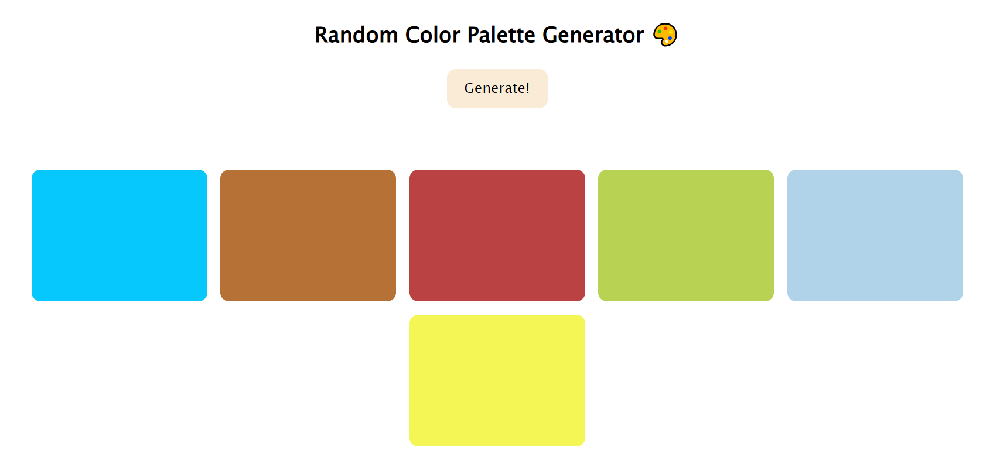

# Random Color Palette Generator 🎨

A simple web app that generates a fresh set of random colors with one click. Each click displays a palette of 5 colors, perfect for design inspiration or just messing around with colors.

---

## 🚀 Features

- Generates 5 random colors instantly
- Click the button to get a new palette
- Clean and minimal UI
- Built with vanilla **HTML, CSS, and JavaScript**

---

## Preview

## ✅ How to Use

1. Open the project folder
2. Run `index.html` in your browser
3. Click the **"Generate!"** button
4. Enjoy the new palette 🎉

## OR

## [Live Link](https://faiyaz-xyz.github.io/random-color-palette-generator/)

---

## 🛠 Tech Stack

- HTML
- CSS
- JavaScript

---

## 📌 Future Improvements (Optional Ideas)

- Show hex codes on each color
- Copy color on click
- Download palette as an image
- Save favorite palettes

---

Made by **Faiyaz** 😎
